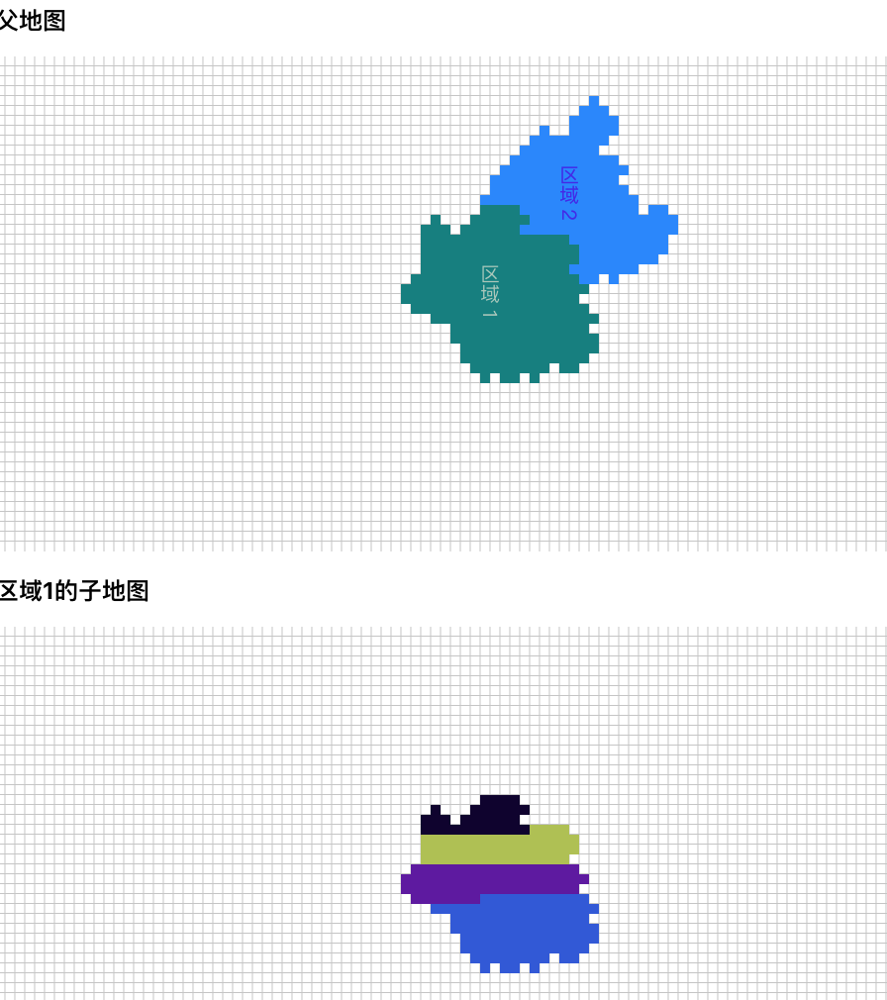
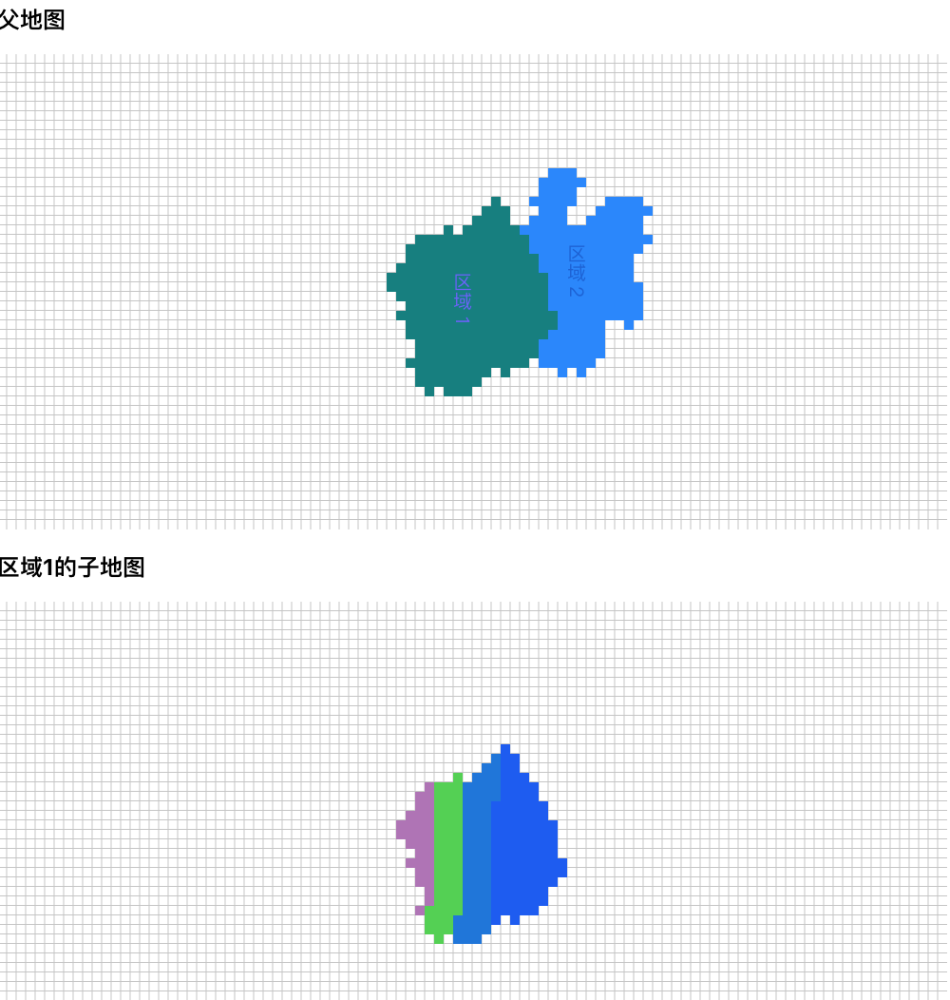
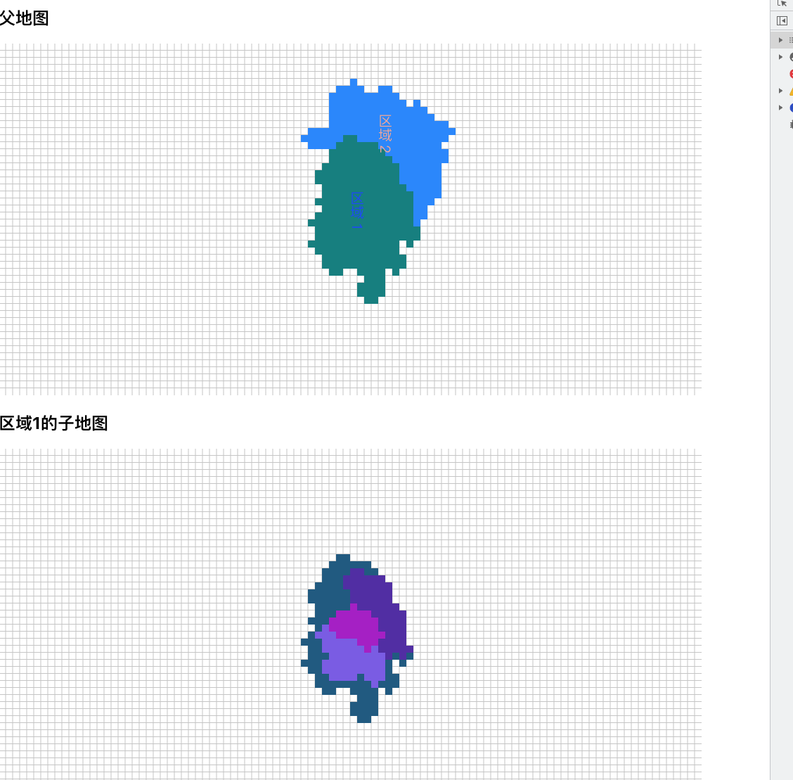

# js-map-generator

按照一定的比例随机生成地图和子地图;

## 效果

水平填充子地图:



垂直填充子地图:



随机填充子地图:



## 使用

```js

npm install js-map-generator

```

## 随机生成父地图

### 使用

```js
import { MainMap } from "js-map-generator";
// render部分
<MainMap
  mapData={realData}
  callback={(info) => {
    this.setState({
      selectMapInfo: info,
    });
  }}
/>;
```

### 要求的数据结构

```json
[
  {
    "name": "区域1",
    "color": "rgb(0,139,139)",
    "value": 240,
    "children": [
      {
        "name": "子区域1",
        "value": 100
      },
      {
        "name": "子区域2",
        "value": 50
      },
      {
        "name": "子区域3",
        "value": 30
      },
      {
        "name": "子区域4",
        "value": 60
      }
    ]
  },
  {
    "name": "区域2",
    "color": "rgb(30,144,255)",
    "value": 180,
    "children": [
      {
        "name": "子区域1-1",
        "value": 40
      },
      {
        "name": "子区域2-1",
        "value": 50
      },
      {
        "name": "子区域3-1",
        "value": 30
      },
      {
        "name": "子区域4-1",
        "value": 60
      }
    ]
  }
]
```

### API(props)

```js
{
    mapData: ItemMapData[]; // 数据源
  callback?: (info: MapItemInfoType) => void; // 地图点击事件回调

 // 地图相关
  mapWidth: number; // 地图宽度
  mapHeight: number; // 地图高度
  gridSize: number; // 网格宽高
  mapColorRandom?: boolean; // 是否随机生成地图颜色
  showLine?: boolean; // 是否显示辅助线

  // 标签相关
  showLabel?: boolean; // 是否展示地图标签
  label?: {
    // 标签信息
    color: string; // 标签颜色
    fontSize: number; // 标签字体
    fontWeight: "bold" | number;
    fontFamily: string; // 字体
    labelDirection:'verticel' | 'horizontal' // 标签渲染方向
  };
  }
}

```

## 子地图

### 使用

```js
import DetailMap from "js-map-generator";

<DetailMap
  {...selectMapInfo}
  showLine={true}
  showType={"random-fill"}
  datas={selectMapInfo.datas || []}
/>;
```

### API(props)

```js

{
  // 数据相关
  center: PointType; // 地图中心点
  name: string; // 地图名称
  id: string; // 地图id
  color: string; // 地图颜色
  positions: {
    // 占用地图的map
    [key: string]: boolean;
  };
  index: number; // 数据层的index
  textColor: string;
  datas?: ItemMapData[]; // 子地图的数据

  // 点击事件
  callback:(info)=>void;

  // 子地图展示类型
   showType: "parent" | "average" | "average-vertical" | "random-fill"; // 分别代表：只展示父地图，横向按比例展示子地图，总线按比例展示子地图，随机占比展示子地图

  // 地图相关
  mapWidth: number; // 地图宽度
  mapHeight: number; // 地图高度
  gridSize: number; // 网格宽高
  mapColorRandom?: boolean; // 是否随机生成地图颜色
  showLine?: boolean; // 是否显示辅助线

  // 标签相关
  showLabel?: boolean; // 是否展示地图标签
  label?: {
    // 标签信息
    color: string; // 标签颜色
    fontSize: number; // 标签字体
    fontWeight: "bold" | number;
    fontFamily: string; // 字体
    labelDirection:'verticel' | 'horizontal' // 标签渲染方向
  };
  }

```
